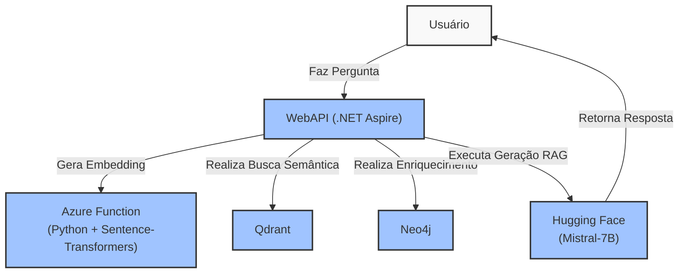

# VectorSearchDotnet 🧠 (RAG + Graph Full Stack)

**VectorSearchDotnet** é um projeto completo de **Retrieval-Augmented Generation (RAG)** com IA Generativa, Embeddings, Banco de Grafos e Vetores, 100% em .NET 8 e Clean Architecture.

---

### 🔧 Tecnologias Utilizadas

- ✅ .NET 8 (Minimal APIs com Aspire)
- ✅ Clean Architecture (Domain, Application, Infrastructure, WebAPI)
- ✅ Docker (Orquestração local completa)
- ✅ Qdrant (Vector Database)
- ✅ Neo4j (Graph Database)
- ✅ Azure Functions (Python Embedding Service)
- ✅ Sentence-Transformers (via Azure Function)
- ✅ Hugging Face Inference API (Geração RAG com Mistral-7B)
- ✅ Refit (HTTP client de alto nível)
- ✅ MediatR, AutoMapper, Serilog
- ✅ Testes com xUnit, FluentAssertions e NSubstitute

---

## 🧠 Arquitetura Completa



---

## 🚀 Como Executar

Clone o repositório:

```bash
git clone https://github.com/rafaellarrosa/VectorSearchDotnet.git
cd VectorSearchDotnet
```

Subir toda a stack com Aspire:

```bash
dotnet run --project src/AppHost/AppHost.csproj
```

Acesse o Swagger para testar:

```
http://localhost:{porta}/swagger
```

---

## 🔗 Integrações Externas

- **Azure Functions (Python)**  
  - Embedding gerado com `sentence-transformers/all-mpnet-base-v2` localmente

- **Hugging Face Inference API**
  - Modelo generativo: `mistralai/Mistral-7B-Instruct-v0.1`

- **Qdrant** (Docker com volume persistente)

- **Neo4j** (Docker standalone via Aspire)

---

## 🛠️ Endpoints Principais

| Método | Rota       | Função                                 |
| ------ | ---------- | -------------------------------------- |
| POST   | /documents | Indexa novo documento (Qdrant + Neo4j) |
| GET    | /search    | Realiza busca semântica + geração RAG  |

---

## 🔬 Pipeline do RAG com Graph

1️⃣ Azure Function gera embedding via Sentence-Transformers  
2️⃣ Busca vetorial no Qdrant  
3️⃣ Enriquecimento com relações no Neo4j  
4️⃣ Gera resposta final com Hugging Face Mistral-7B

---

## 🔮 Extensões futuras

- Upload de PDFs e processamento automático
- Extração de entidades e criação automática de nós no grafo
- UI frontend (Blazor ou React)
- Histórico de consultas e dashboard analítico
- Melhorias no pipeline com CoT (Chain-of-Thought prompting)
- Cache de embeddings para otimização

---

## 📖 Sobre o projeto

Este projeto é uma fundação para:

- RAG corporativo (jurídico, financeiro, documentos técnicos)
- Assistentes de IA contextuais
- Pesquisa semântica híbrida (embedding + grafo)
- Sistemas de recomendação explicáveis

---

## 👨‍💻 Autor

**Rafael Larrosa**  
[GitHub](https://github.com/rafaellarrosa)
