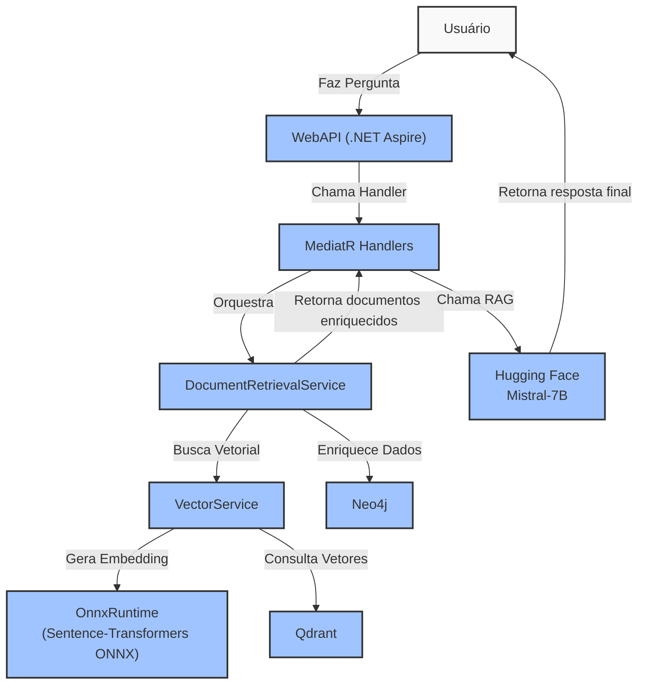

# VectorSearchDotnet 🤠 (RAG + Graph Full Stack - Clean Architecture)

**VectorSearchDotnet** é uma stack completa de **Retrieval-Augmented Generation (RAG)** com IA Generativa, Vetores, Grafos e Orquestração semântica — 100% em **.NET 8 Clean Architecture**.

---

## 🔧 Tecnologias Utilizadas

- ✅ .NET 8 (Minimal APIs + Aspire)
- ✅ Clean Architecture (Application, Infrastructure, Domain)
- ✅ Docker (Infra local completa)
- ✅ Qdrant (Vector Database)
- ✅ Neo4j (Graph Database)
- ✅ OnnxRuntime (Embedding local com Sentence-Transformers)
- ✅ Hugging Face Inference API (Mistral-7B RAG)
- ✅ MediatR, AutoMapper, Serilog
- ✅ Testes com xUnit, FluentAssertions e NSubstitute

---

## 🧠 Arquitetura Completa



---

## 🚀 Como Executar

Clone o repositório:

```bash
git clone https://github.com/rafaellarrosa/VectorSearchDotnet.git
cd VectorSearchDotnet
```

Suba toda a stack com Aspire:

```bash
dotnet run --project src/AppHost/AppHost.csproj
```

Acesse o Swagger para testar:

```
http://localhost:{porta}/swagger
```

---

## 🔗 Integrações Externas

- **Qdrant** (Docker, vetor local)
- **Neo4j** (Docker, grafo)
- **Hugging Face Inference API**
  - Geração de respostas via `mistralai/Mistral-7B-Instruct-v0.1`

---

## 🛠️ Endpoints Principais

| Método | Rota       | Função                                   |
| ------ | ---------- | ---------------------------------------- |
| POST   | /documents | Indexa novo documento (Vetorial + Grafo) |
| GET    | /search    | Busca semântica enriquecida + RAG        |

---

## 🔬 Pipeline RAG Orquestrado

1️⃣ Gera embedding localmente via ONNX (Sentence-Transformers)\
2️⃣ Busca vetorial no Qdrant\
3️⃣ Enriquecimento dos resultados com Neo4j\
4️⃣ Geração de resposta RAG via Hugging Face (Mistral-7B)

---

## 🧱 Camadas principais da solução

- **Handlers (MediatR)** → puro orquestrador de alto nível
- **DocumentRetrievalService** → centraliza indexação + busca + enrich
- **VectorService** → orquestra embeddings e busca vetorial
- **GraphDatabaseService** → integra com Neo4j
- **EmbeddingService** → roda localmente via OnnxRuntime
- **IaService** → conecta com Hugging Face para geração

---

## 🔮 Extensões futuras

- Upload de documentos e parsing automático
- Criação automática de nós relacionados no grafo
- Implementação Chain-of-Thought (CoT)
- Painel de histórico de buscas e explicabilidade
- Implementação de caching de embeddings

---

## 📖 Sobre o projeto

Este projeto é base para:

- Sistemas corporativos de RAG
- Pesquisa semântica híbrida (vetores + grafos)
- Agentes de IA com raciocínio contextual
- Sistemas de recomendação explicáveis

---

## 👨‍💻 Autor

**Rafael Larrosa**\
[GitHub](https://github.com/rafaellarrosa)

